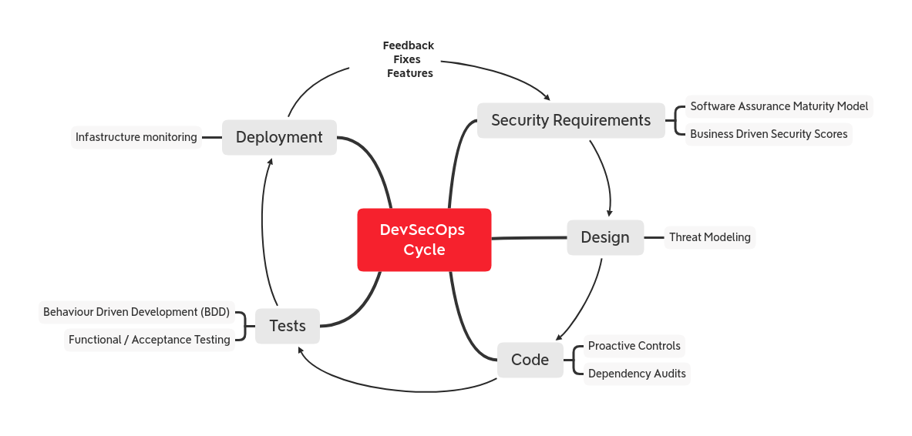
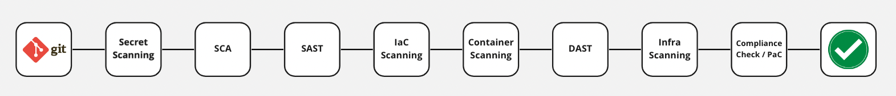

# OWASP DevSecOps ガイドライン
OWASP DevSecOps ガイドラインはどのようにしてセキュアなパイプラインを実装するかを説明し、ベストプラクティスを使用し、この事象に使用できるツールを紹介します。また、このプロジェクトは開発プロセスにおいてシフトレフトのセキュリティ文化を促進することに役立てようとしています。
このプロジェクトは開発パイプライン、つまり DevOps パイプラインを持つあらゆる規模の企業に役立ちます。
このプロジェクトでは、セキュアな DevOps パイプラインの展望を描き、カスタマイズされた要件に基づいてそれを改善していきます。

理想とする目標は **"(設計やアプリケーションの脆弱性による) セキュリティ問題をできるだけ早く検出すること"** です。

## 最初のステップ
DevSecOps とは DevOps にセキュリティを取り込むことです。しかし CI/CD のペースに追いつくためにはソフトウェア作成やテストの初期段階でセキュリティを注入する必要があります。

[OWASP プロアクティブコントロール](https://owasp.org/www-project-proactive-controls/) にはすべての開発者がアプリケーションをコーディングする際に実装しなければならないセキュリティコントロールのトップ 10 をリストしています。このセットは DevSecOps サイクルでコードを設計、記述、またはテストしなければならないときの出発点と考えてください。

また [OWASP ソフトウエアセキュリティ保証成熟度モデル (Software Assurance Maturity Model, SAMM)](https://owaspsamm.org/model/) にしたがって、成熟度に応じたセキュリティ要件 (およびその他) に対して考慮すべきことを確立することができます。

## パイプラインに追加するもの

最初に、基本的なパイプラインに以下のステップを実装することを検討します。
* 潜在的なクレデンシャルの漏洩を発見するために git リポジトリをスキャンする
* SCA (ソフトウェアコンポジション解析)
* SAST (静的アプリケーションセキュリティテスト)
* IaC スキャン (Terraform, HelmChart コードをスキャンして設定ミスを発見する)
* IAST (インタラクティブアプリケーションセキュリティテスト)
* API セキュリティ
* DAST (動的アプリケーションセキュリティテスト)
* CNAPP (クラウドネイティブアプリケーション保護)
* インフラストラクチャスキャン
* 他のツールからの継続的なスキャン
* コンプライアンスチェック

ソフトウェア開発ライフサイクル (SDLC) やソフトウェアアーキテクチャにしたがってパイプラインのステップをカスタマイズし、始めていれば段階的に自動化を追加することができます。
たとえば SAST/DAST からセキュリティコントロールが組み込まれた通常のテストスイートに切り替えたり、既知の脆弱な依存関係をチェックする監査スクリプトを追加することができます。

CI/CD は SecOps にとって有利であり、セキュリティ対策やコントロールのための特権的なエントリポイントとなります。
ただし、CI/CD ツールを使用して自動化を行う場合にはツール自体が攻撃対象領域を拡大することがよくあることに注意します。そのため、ソフトウェアのビルド、デプロイメント、および自動化にセキュリティコントロールを配置します。

---
## 目次:
- [0-概論 (Intro)](current-version/0-Intro)
  - [0-1-序文 (Intro)](current-version/0-Intro/0-1-Intro.md)
  - [0-2-概要 (Overview)](current-version/0-Intro/0-2-Overview.md)
- [1-要員 (People)](current-version/1-People)
  - [1-1-チーム形成 (Shape-the-team)](current-version/1-People/1-1-Shape-the-team)
    - [1-1-1-セキュリティチャンピオン (Security-champions)](current-version/1-People/1-1-Shape-the-team/1-1-1-Security-champions.md)
  - [1-2-トレーニング (Training)](current-version/1-People/1-2-Training)
    - [1-2-1-セキュアコーディング (Secure-coding)](current-version/1-People/1-2-Training/1-2-1-Secure-coding.md)
    - [1-2-2-セキュリティ CI/CD (Security-CICD)](current-version/1-People/1-2-Training/1-2-2-Security-CICD.md)
- [2-プロセス (Process)](current-version/2-Process)
  - [2-1-設計 (Design)](current-version/2-Process/2-1-Design)
    - [2-1-1-脅威モデリング (Threat-modeling)](current-version/2-Process/2-1-Design/2-1-1-Threat-modeling.md)
  - [2-2-コード (Code)](current-version/2-Process/2-2-Code)
    - [2-2-3-インタラクティブアプリケーションセキュリティテスト (Interactive-Application-Security-Testing)](current-version/2-Process/2-2-Code/2-2-3-Interactive-Application-Security-Testing.md)
    - [2-2-1-コミット前 (Pre-commit)](current-version/2-Process/2-2-Code/2-2-1-Pre-commit)
      - [2-2-1-1-プレコミット (Pre-commit)](current-version/2-Process/2-2-Code/2-2-1-Pre-commit/2-2-1-1-Pre-commit.md)
      - [2-2-1-2-シークレット管理 (Secrets-Management)](current-version/2-Process/2-2-Code/2-2-1-Pre-commit/2-2-1-2-Secrets-Management.md)
      - [2-2-1-3-コードのリンティング (Linting-code)](current-version/2-Process/2-2-Code/2-2-1-Pre-commit/2-2-1-3-Linting-code.md)
      - [2-2-1-4-リポジトリ堅牢化 (Repository-Hardening)](current-version/2-Process/2-2-Code/2-2-1-Pre-commit/2-2-1-4-Repository-Hardening.md)
    - [2-2-2-静的解析 (Static-Analysis)](current-version/2-Process/2-2-Code/2-2-2-Static-Analysis)
      - [2-2-2-1-静的アプリケーションセキュリティテスト (Static-Application-Security-Testing)](current-version/2-Process/2-2-Code/2-2-2-Static-Analysis/2-2-2-1-Static-Application-Security-Testing.md)
      - [2-2-2-2-ソフトウェアコンポジション解析 (Software-Composition-Analysis)](current-version/2-Process/2-2-Code/2-2-2-Static-Analysis/2-2-2-2-Software-Composition-Analysis.md)
      - [2-2-2-3-Infastructure as Code (Infastructure-as-Code-Scanning)](current-version/2-Process/2-2-Code/2-2-2-Static-Analysis/2-2-2-3-Infastructure-as-Code-Scanning.md)
      - [2-2-2-4-コンテナセキュリティ (Container-Security)](current-version/2-Process/2-2-Code/2-2-2-Static-Analysis/2-2-2-4-Container-Security)
        - [2-2-2-4-1-コンテナスキャン (Container-Scanning)](current-version/2-Process/2-2-Code/2-2-2-Static-Analysis/2-2-2-4-Container-Security/2-2-2-4-1-Container-Scanning.md)
        - [2-2-2-4-2-コンテナ堅牢化 (Container-Hardening)](current-version/2-Process/2-2-Code/2-2-2-Static-Analysis/2-2-2-4-Container-Security/2-2-2-4-2-Container-Hardening.md)
  - [2-3-ビルド (Build)](current-version/2-Process/2-3-Build)
    - [2-3-1-動的アプリケーションセキュリティテスト (Dynamic-Application-Security-Testing)](current-version/2-Process/2-3-Build/2-3-1-Dynamic-Application-Security-Testing.md)
    - [2-3-2-モバイルアプリケーションセキュリティテスト (Mobile-Application-Security-Test)](current-version/2-Process/2-3-Build/2-3-2-Mobile-Application-Security-Test.md)
    - [2-3-3-API セキュリティ (API-Security)](current-version/2-Process/2-3-Build/2-3-3-API-Security.md)
    - [2-3-4-構成ミスチェック (Miss-Configuration-Check)](current-version/2-Process/2-3-Build/2-3-4-Miss-Configuration-Check.md)
  - [2-4-運用 (Operation)](current-version/2-Process/2-4-Operation)
    - [2-4-1-クラウドネイティブセキュリティ (Cloud-Native-Security)](current-version/2-Process/2-4-Operation/2-4-1-Cloud-Native-Security.md)
    - [2-4-2-ログ記録と監視 (Logging-and-Monitoring)](current-version/2-Process/2-4-Operation/2-4-2-Logging-and-Monitoring.md)
    - [2-4-3-ペンテスト (Pentest)](current-version/2-Process/2-4-Operation/2-4-3-Pentest.md)
    - [2-4-4-脆弱性管理 (Vulnerability-Management)](current-version/2-Process/2-4-Operation/2-4-4-Vulnerability-Management.md)
    - [2-4-5-VDP|バグバウンティ (VDP|Bug-bounty)](current-version/2-Process/2-4-Operation/2-4-5-VDP|Bug-bounty.md)
    - [2-4-6-侵害と攻撃のシミュレーション (Breach-and-attack-simulation)](current-version/2-Process/2-4-Operation/2-4-6-Breach-and-attack-simulation.md)
- [3-ガバナンス (Governance)](current-version/3-Governance)
  - [3-2-データ保護 (Data-protection)](current-version/3-Governance/3-2-Data-protection.md)
  - [3-1-コンプライアンス監査 (Compliance-Auditing)](current-version/3-Governance/3-1-Compliance-Auditing)
    - [3-1-1-コンプライアンス監査 (Compliance-Auditing)](current-version/3-Governance/3-1-Compliance-Auditing/3-1-1-Compliance-Auditing.md)
    - [3-1-2-Policy as Code (Policy-as-code)](current-version/3-Governance/3-1-Compliance-Auditing/3-1-2-Policy-as-code.md)
    - [3-1-3-セキュリティベンチマーク (Security-benchmarking)](current-version/3-Governance/3-1-Compliance-Auditing/3-1-3-Security-benchmarking.md)
  - [3-3-レポーティング (Reporting)](current-version/3-Governance/3-3-Reporting)
    - [3-3-1-成熟度追跡 (Tracking-maturities)](current-version/3-Governance/3-3-Reporting/3-3-1-Tracking-maturities.md)
    - [3-3-2-脆弱性一元管理ダッシュボード (Central-vulnerability-management-dashboard)](current-version/3-Governance/3-3-Reporting/3-3-2-Central-vulnerability-management-dashboard.md)

---
OWASP ウェブサイトのプロジェクトページは [こちら](https://owasp.org/www-project-devsecops-guideline/) です
