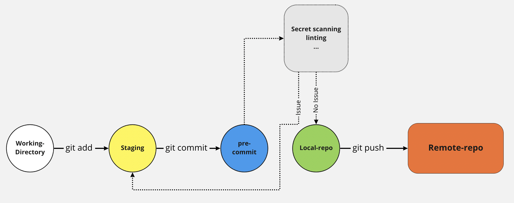

## プレコミット (Pre-commit)

コミット前 (pre-commit) のフェーズは重要です。中心となる (Git) リポジトリに送信される前にセキュリティの問題を防ぐことができるためです。

コードにシークレットがないこと、およびコードが特定の (Linter ルールによる) ガイドラインに準拠していることを確認することが、より質の高いコードにつながります。

以下では、次のようなさまざまなタイプのコミット前 (pre-commit) アクションについて説明します。
1. シークレットの管理
2. コードのリンティング

**pre-commit** は **シフトレフトセキュリティ** アプローチの一部として活用できる git 機能です。これは開発者が SDLC プロセスの早い段階でソースコードの問題を確認できるようになります。開発者が git-commit コマンドを実行してローカルリポジトリにコードをコミットする際、**pre-commit hook** チェックをセキュリティスキャンツールと統合して、コード品質の問題、ハードコードされたシークレット、安全でないコード、脆弱な依存関係/オープンソースライブラリなどを探すことができます。

pre-commit hook は開発者のローカルリポジトリレベルにあり、同じプロジェクトやアプリケーションで作業しているすべての開発者が共通に使用するリモートリポジトリではないことに注意してください。このような場合、セキュリティ上の問題がリモートや中央の (Git) リポジトリに送信される前に防止する必要があるときには、**pre-push hook** または **git-push** チェックを構成できます。参照: https://git-scm.com/docs/git-push

セキュリティ上の問題 (ハードコードされたシークレット、安全でないコード、脆弱な依存関係/オープンソースライブラリなど) のためにソースコードをスキャンする別の代替アプローチは **SAST/SCA IDE プラグイン** を使用することです。これは開発者がコードを書く際に使用する IDE と連携して機能します。一方、git-commit および git-push アクションは開発者がコードを書いた後に使用されます。要件に基づいてさまざまなレベルで適切なセキュリティコントロールを実装するには、これらの明確なユースケースを識別する必要があります。

以下の画像は pre-commit が何を意味し、なぜそれを考慮しなければならないかをよりよく理解するためのものです。

## ツール:

+ [Pre-Commit](https://pre-commit.com/) - 多言語の pre-commit フックを管理および維持するためのフレームワークです。

### 参考情報

+ [Wikipedia - Lint (software)](https://en.wikipedia.org/wiki/Lint_(software))
