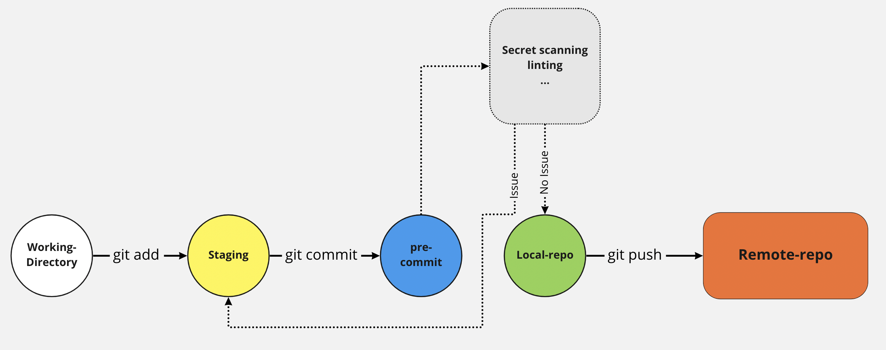

## コードのリンティング

### リンティングとは何か？
リンティングはソースコードのプログラム上のエラーやスタイル上のエラーについて自動チェックすることです。これは lint ツール (linter とも呼ばれます) を使用して行われます。 lint ツールは基本的な静的コードアナライザです。

### リンティングで何ができるか？
- リンティングはコードの **エラーを検出** できます。エラーはセキュリティ脆弱性につながる可能性があります。
- リンターは **フォーマットやスタイルの問題を検出** することもでき、コードを読みやすくし、よりセキュアなコードにします。
- リンターは **ベストプラクティスを提案** できます。
- また **コード全体の品質を向上させる** こともできます。
- 全員が同じリンティングルールに従うため、 **コードのメンテナンスが容易になります** 。

### 基本的な lint ツール
lint ツールは静的解析の最も基本的な形式です。 lint ツールを使用すると、以下のような一般的なエラーを特定するのに役立ちます。
- 配列を超えたインデックス。
- null ポインタの間接参照。
- (潜在的に) 危険なデータ型の組み合わせ。
- 到達できないコード。
- 移植できない構造。

### 高度な静的解析ツール
高度な静的解析ツールは一般的に以下の機能を提供します。
- パターンベースのシミュレーション。
- 品質と複雑さのメトリクス。
- 開発者向けのベストプラクティスの推奨事項。
- 複数の安全性とセキュリティに焦点を当てたコーディング標準のサポート。
- 安全性が重要なアプリケーションの開発に使用できる標準認定。

### リンターに関する問題
+ すべての言語に "高品質" の標準リンターツールが用意されているわけではありません。通常、各フレームワークには一つまたは複数のリンターがあります。
+ バージョンや設定が異なると結果が異なることがあります。
+ 一部のリンターは非常に冗長であり、情報過多により "重要でない" 問題に焦点が当たる可能性があります。

### リンターをいつどこで使用するか？

**pre-commit** フェーズで実行できます。つまり、ローカルリポジトリにあるコードをローカルクローンに実際にコミットする前にローカルで実行します。リンティングをよく目にするもう一つのフェーズは **build** フェーズです。ここではビルドサーバーが git リポジトリからコードをプルし、それに対してリンティングを実行し、リンティングフェーズからの結果を報告します。

### 参考情報

+ [Preforce](https://www.perforce.com/blog/qac/what-lint-code-and-why-linting-important)
