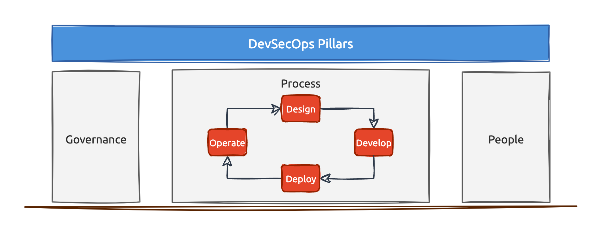

# OWASP DevSecOps ガイドライン

これは OWASP DevSecOps ガイドラインの現行版です。安全なソフトウェアデリバリパイプラインの構築および運用方法を説明し、**シフトレフト** (シフトエブリウェア) セキュリティ文化を推進するとともに、あらゆる規模の組織に向けたベンダー中立のプラクティスやツールを示します。

このガイドラインは DevSecOps の三つの主要な柱を中心に構成されています。

- **要員 (People)** — チーム、役割、文化、トレーニング。
- **プロセス (Process)** — ソフトウェア開発ライフサイクルのあらゆる段階に編み込まれたセキュリティ活動。
- **ガバナンス (Governance)** — コンプライアンス、測定、報告、監視。

**プロセス (Process)** の下には、製品開発ライフサイクルは、**設計 (Design)**、**開発 (Develop)**、**ビルド (Build)**、**テスト (Test)**、**リリース (Release)**、**デプロイ (Deploy)**、**運用 (Operate)** の七つの段階に区分され、それぞれにセキュリティコントロールが割り当てられています。

この改訂では 2025/2026 に向けてすべてのトピックを刷新し、ソフトウェアサプライチェーンセキュリティ (SBOM、署名/来歴、CI/CD パイプラインセキュリティ)、AI 支援開発と AI ガバナンス、Application Security Posture Management (ASPM) といった現代的な課題の対応を追加しました。また、NIST SSDF, OWASP SAMM, OWASP DSOMM, SLSA などのフレームワークとの整合性を明示しました。

以前の版を必要とする場合には、[old-versions](../old-versions/) ディレクトリを参照してください。

## 目次

- [0-概論 (Intro)](0-Intro)
  - [0-1-序文 (Intro)](0-Intro/0-1-Intro.md)
  - [0-2-概要 (Overview)](0-Intro/0-2-Overview.md)
  - [0-3-フレームワークと標準 (Frameworks-and-Standards)](0-Intro/0-3-Frameworks-and-Standards.md)
- [1-要員 (People)](1-People)
  - [1-1-チーム形成 (Shape-the-team)](1-People/1-1-Shape-the-team)
    - [1-1-1-セキュリティチャンピオン (Security-champions)](1-People/1-1-Shape-the-team/1-1-1-Security-champions.md)
    - [1-1-2-役割と責任 (Roles-and-Responsibilities)](1-People/1-1-Shape-the-team/1-1-2-Roles-and-Responsibilities.md)
  - [1-2-トレーニング (Training)](1-People/1-2-Training)
    - [1-2-1-セキュアコーディング (Secure-coding)](1-People/1-2-Training/1-2-1-Secure-coding.md)
    - [1-2-2-セキュリティ CI/CD (Security-CICD)](1-People/1-2-Training/1-2-2-Security-CICD.md)
    - [1-2-3-セキュリティ文化と意識 (Security-culture-and-awareness)](1-People/1-2-Training/1-2-3-Security-culture-and-awareness.md)
- [2-プロセス (Process)](2-Process)
  - [2-1-設計 (Design)](2-Process/2-1-Design)
    - [2-1-1-脅威モデリング (Threat-modeling)](2-Process/2-1-Design/2-1-1-Threat-modeling.md)
    - [2-1-2-セキュアな設計と要件 (Secure-design-and-requirements)](2-Process/2-1-Design/2-1-2-Secure-design-and-requirements.md)
  - [2-2-開発 (Develop)](2-Process/2-2-Develop)
    - [2-2-1-コミット前 (Pre-commit)](2-Process/2-2-Develop/2-2-1-Pre-commit)
      - [2-2-1-1-プレコミット (Pre-commit)](2-Process/2-2-Develop/2-2-1-Pre-commit/2-2-1-1-Pre-commit.md)
      - [2-2-1-2-シークレット管理 (Secrets-Management)](2-Process/2-2-Develop/2-2-1-Pre-commit/2-2-1-2-Secrets-Management.md)
      - [2-2-1-3-コードのリンティング (Linting-code)](2-Process/2-2-Develop/2-2-1-Pre-commit/2-2-1-3-Linting-code.md)
      - [2-2-1-4-リポジトリ堅牢化 (Repository-Hardening)](2-Process/2-2-Develop/2-2-1-Pre-commit/2-2-1-4-Repository-Hardening.md)
    - [2-2-2-IDE と AI 支援開発 (IDE-and-AI-assisted-development)](2-Process/2-2-Develop/2-2-2-IDE-and-AI-assisted-development.md)
  - [2-3-ビルド (Build)](2-Process/2-3-Build)
    - [2-3-1-静的解析 (Static-Analysis)](2-Process/2-3-Build/2-3-1-Static-Analysis)
      - [2-3-1-1-静的アプリケーションセキュリティテスト (Static-Application-Security-Testing)](2-Process/2-3-Build/2-3-1-Static-Analysis/2-3-1-1-Static-Application-Security-Testing.md)
    - [2-3-2-ソフトウェアコンポジション解析 (Software-Composition-Analysis)](2-Process/2-3-Build/2-3-2-Software-Composition-Analysis)
      - [2-3-2-1-ソフトウェアコンポジション解析 (Software-Composition-Analysis)](2-Process/2-3-Build/2-3-2-Software-Composition-Analysis/2-3-2-1-Software-Composition-Analysis.md)
    - [2-3-3-コンテナセキュリティ (Container-Security)](2-Process/2-3-Build/2-3-3-Container-Security)
      - [2-3-3-1-コンテナスキャン (Container-Scanning)](2-Process/2-3-Build/2-3-3-Container-Security/2-3-3-1-Container-Scanning.md)
      - [2-3-3-2-コンテナ堅牢化 (Container-Hardening)](2-Process/2-3-Build/2-3-3-Container-Security/2-3-3-2-Container-Hardening.md)
    - [2-3-4-Infastructure as Code セキュリティ (Infrastructure-as-Code-Security)](2-Process/2-3-Build/2-3-4-Infrastructure-as-Code-Security)
      - [2-3-4-1-Infastructure as Code スキャン (Infrastructure-as-Code-Scanning)](2-Process/2-3-Build/2-3-4-Infrastructure-as-Code-Security/2-3-4-1-Infrastructure-as-Code-Scanning.md)
    - [2-3-5-セキュリティゲート (Security-Gates)](2-Process/2-3-Build/2-3-5-Security-Gates.md)
    - [2-3-6-サプライチェーンセキュリティ (Supply-Chain-Security)](2-Process/2-3-Build/2-3-6-Supply-Chain-Security)
      - [2-3-6-1-SBOM (SBOM)](2-Process/2-3-Build/2-3-6-Supply-Chain-Security/2-3-6-1-SBOM.md)
      - [2-3-6-2-アーティファクトの署名と来歴 (Artifact-Signing-and-Provenance)](2-Process/2-3-Build/2-3-6-Supply-Chain-Security/2-3-6-2-Artifact-Signing-and-Provenance.md)
      - [2-3-6-3-CICD パイプラインセキュリティ (CICD-Pipeline-Security)](2-Process/2-3-Build/2-3-6-Supply-Chain-Security/2-3-6-3-CICD-Pipeline-Security.md)
  - [2-4-テスト (Test)](2-Process/2-4-Test)
    - [2-4-1-インタラクティブアプリケーションセキュリティテスト (Interactive-Application-Security-Testing)](2-Process/2-4-Test/2-4-1-Interactive-Application-Security-Testing.md)
    - [2-4-2-動的アプリケーションセキュリティテスト (Dynamic-Application-Security-Testing)](2-Process/2-4-Test/2-4-2-Dynamic-Application-Security-Testing.md)
    - [2-4-3-モバイルアプリケーションセキュリティテスト (Mobile-Application-Security-Test)](2-Process/2-4-Test/2-4-3-Mobile-Application-Security-Test.md)
    - [2-4-4-API セキュリティ (API-Security)](2-Process/2-4-Test/2-4-4-API-Security.md)
    - [2-4-5-構成ミスチェック (Misconfiguration-Check)](2-Process/2-4-Test/2-4-5-Misconfiguration-Check.md)
  - [2-5-リリース (Release)](2-Process/2-5-Release)
    - [2-5-1-リリース (Release)](2-Process/2-5-Release/2-5-1-Release.md)
  - [2-6-デプロイ (Deploy)](2-Process/2-6-Deploy)
    - [2-6-1-デプロイ (Deploy)](2-Process/2-6-Deploy/2-6-1-Deploy.md)
  - [2-7-運用 (Operate)](2-Process/2-7-Operate)
    - [2-7-1-クラウドネイティブセキュリティ (Cloud-Native-Security)](2-Process/2-7-Operate/2-7-1-Cloud-Native-Security.md)
    - [2-7-2-ログ記録と監視 (Logging-and-Monitoring)](2-Process/2-7-Operate/2-7-2-Logging-and-Monitoring.md)
    - [2-7-3-ペンテスト (Pentest)](2-Process/2-7-Operate/2-7-3-Pentest.md)
    - [2-7-4-脆弱性管理 (Vulnerability-Management)](2-Process/2-7-Operate/2-7-4-Vulnerability-Management.md)
    - [2-7-5-VDP とバグバウンティ (VDP-and-Bug-bounty)](2-Process/2-7-Operate/2-7-5-VDP-and-Bug-bounty.md)
    - [2-7-6-侵害と攻撃のシミュレーション (Breach-and-attack-simulation)](2-Process/2-7-Operate/2-7-6-Breach-and-attack-simulation.md)
- [3-ガバナンス (Governance)](3-Governance)
  - [3-1-コンプライアンス監査 (Compliance-Auditing)](3-Governance/3-1-Compliance-Auditing)
    - [3-1-1-コンプライアンス監査 (Compliance-Auditing)](3-Governance/3-1-Compliance-Auditing/3-1-1-Compliance-Auditing.md)
    - [3-1-2-Policy as Code (Policy-as-code)](3-Governance/3-1-Compliance-Auditing/3-1-2-Policy-as-code.md)
    - [3-1-3-セキュリティベンチマーク (Security-benchmarking)](3-Governance/3-1-Compliance-Auditing/3-1-3-Security-benchmarking.md)
  - [3-2-データ保護 (Data-protection)](3-Governance/3-2-Data-protection.md)
  - [3-3-レポーティング (Reporting)](3-Governance/3-3-Reporting)
    - [3-3-1-成熟度追跡 (Tracking-maturities)](3-Governance/3-3-Reporting/3-3-1-Tracking-maturities.md)
    - [3-3-2-脆弱性一元管理ダッシュボード (Central-vulnerability-management-dashboard)](3-Governance/3-3-Reporting/3-3-2-Central-vulnerability-management-dashboard.md)
    - [3-3-3-ASPM (ASPM)](3-Governance/3-3-Reporting/3-3-3-ASPM.md)
  - [3-4-AI ガバナンスとリスク (AI-Governance-and-Risk)](3-Governance/3-4-AI-Governance-and-Risk.md)
