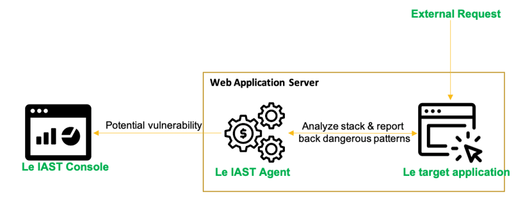

## DevSecOps 入門

現在、DevOps はあらゆる組織が驚くべき速さで変更を本番環境にデプロイできる力を与えています。
このプロセスでは納品時間が非常に重要な要素であるため、セキュリティ担当者の主な問いは
「このプロセスをどのようにしてセキュアにできるか」もしくは「納品物をどの程度セキュアにするか」となります。
これに関して、DevOps プロセス全体にいくつかのセキュリティ関連のステップを組み込んで、いくつかの自動テストを実行できます。
したがって DevSecOps またはセキュアな DevOps 文化を考慮することで、自社のシフトレフトセキュリティ戦略を推進するのに役立ちます。
少なくとも技術部門では。

### シフトレフトセキュリティ戦略とは

簡単に定義すると、シフトレフトセキュリティ戦略は開発プロセスの一環としてセキュリティを組み込む方法またはソリューションで、
アプリケーションやシステムの設計の初期段階からセキュリティを考慮します。
つまり、セキュリティはソフトウェア開発および運用プロセスに携わるすべての人に責任があるということです。
もちろん、セキュリティは専門職であり、セキュリティ関連の役割を担うには高度なスキルを持つ人材が必要です。
しかしこのアプローチでは、設計者、ソフトウェアアーキテクチャ、開発者、DevOps エンジニアなどがセキュリティ担当者とともにセキュリティに関して責任を負います。

### Dev+Sec+Ops

互いにカバーするこれらの 3 つのそれぞれの領域がこの図のようなものであると考えると、
つまり上記の言葉の結論として、いくつかのツールを実装し、DevSecOps 文化の促進にも取り組む必要があります。

DevSecOps foundation の創設者である Shannon Lietz は次のように述べています。

> DevSecOps の目的と意図は、必要な安全性を犠牲にすることなく、最高レベルのコンテキストを保持する人々にセキュリティ上の決定を迅速かつ大規模に安全に配布することを目標として、「全員がセキュリティに責任を持つ」という考え方に基づいて構築されています。

### DevSecOps 文化

前に聞いているように、シフトレフトセキュリティについてお話ししたいと思います。
これは (簡単に定義すると) 設計からセキュリティを考慮すべきだということであり、開発プロセスの早い段階でセキュリティを動かすことを目標としています。

あなたは DevOps チームで働いていて、従来のセキュリティテストを行っているとしましょう。
(それで、すべての QA テストが終了し、本番環境に移行する前に) 何が起こるでしょうか。
そうですね。すべてのバグは早急に修正されなければならず、開発者チームは問題を修正しなければならないというプレッシャーにさらされます。
QA テストを再度実行し、セキュリティテストを再度実行する必要があります。
これはコスト、費用と時間、が増えることを意味します。
最終的には、ビジネスチームが好きではないセキュリティ事象のために軽快さを犠牲にします。

解決策は最終ステップではなくプロセスの早い段階でセキュリティを導入することです。
脅威モデリングで設計時にセキュリティを考慮したり
膨大なセキュリティテストを小規模なセキュリティテストに分割してそれらを開発パイプラインに統合します。

以下の図は DevOps と DevSecOps のライフサイクルの違いを示しています。

### プライバシー

GDPR (Europe's General Data Protection Regulations, EU一般データ保護規則)、CCPA (California Consumer Privacy Act, カリフォルニア州消費者プライバシー法)、LGPD (Brazil's Lei Geral de Proteção de Dados, ブラジルの個人情報保護法) などの法規制が世界中で施行されていることから、プライバシーはあらゆる規模の企業にとって主要なトピックになっています。

大量の PII (個人を特定できる情報) を処理するアプリケーションは DevSecOps を採用してプライバシーバイデザインアプローチに従うようにすべきです。このアプローチでは開発プロセスがサイクル全体を通じてプライバシー問題に対処します。

### ソフトウェアテスト戦略

テストについて話す際、念頭に置くべきは、
テストにはさまざまな定義があり、それによって
セキュアな DevSecOps サイクルを実現するためのルートが変わることです。
この定義を見てみましょう。

#### さまざまなソフトウェアテスト戦略

1. **ポジティブテスト**

ポジティブテストでは、通常の条件と入力の下で、
すべてが期待どおりに動作することを前提としています。
これは有効で関連性のあることのみが発生するという前提で実行されます。
データセットやその他すべての機能は期待どおりとなるでしょう。

2. **ネガティブテスト**

ネガティブテストでは想定外の条件下でのシステムの挙動をチェックします。
ネガティブテストは高性能ソフトウェア開発において非常に非常に重要な役割を果たします。
想定外の条件や入力下でのソフトウェアの挙動をチェックします。

#### テスト手法

1. **静的テスト**

   静的テストはアプリケーションコードを実行せずにソフトウェアの欠陥をチェックします。
   障害の原因を見つけやすく簡単に修正できるため、エラーを回避するために開発の初期段階で実行されます。
   動的テストでは見つけられない問題でも、静的テストでは簡単に見つけられるものがあります。そのような問題にはハードコードされたクレデンシャル、非推奨の暗号化アルゴリズム、セカンドオーダーインジェクション、脆弱な乱数などがあります。
   ほとんどの静的解析ツールではテストスコープが一つのコンポーネントに限定されており、異なるコンポーネント間でのテストを行うことはできません。 (たとえば、マイクロサービスアーキテクチャの場合、静的解析ツールは各マイクロサービスを個別にテストします)
   

2. **動的テスト**

   動的テストでは実行時のアプリケーションコードの動作を解析します。スキャナは特別に細工されたリクエストをターゲットアプリケーションに送信します。リクエストパラメータはさまざまな脆弱性を明らかにしようとするため、テスト中に絶えず変更されます。アプリケーションのレスポンスに基づいて、ツールは潜在的な脆弱性を特定し、報告します。静的解析では見つけられない問題でも、動的解析では簡単に検出できるものがあります。そのような問題には認証やセッションの問題、平文で送信される機密データなどのクライアント側の脆弱性があります。
   動的解析ツールはアプリケーションフロー全体を (複数コンポーネントを同時に) テストできる可能性があります。 (たとえば、マイクロサービスアーキテクチャの場合、動的解析ツールは一つのマイクロサービスを指定することができますが、それらが相互に作用するため結果はアプリケーション全体の動作を表します)
   
   

3. **インタラクティブ解析**
   
   インタラクティブアプリケーションセキュリティテスト (IAST) とも呼ばれ、他のシステムがアプリケーションと相互連携する際にアプリケーションを監視し、脆弱性を観察します。これはアプリケーションでデプロイされるセンサーやエージェントによって実現されます。センサーは HTTP リクエストから、実行されたコードまでフロー全体を見て、アプリケーションを介してデータを追跡します。静的解析と同様に、一度に一つのコンポーネントをテストできますが、複数のコンポーネントはできません。ただし、エージェントやセンサーがすべてのコンポーネントにデプロイされている場合、それらが相互連携するとアプリケーションで使用される各コンポーネントの脆弱性が明らかになる可能性があります。 (たとえば、マイクロサービスアーキテクチャの場合、エージェントやセンサーが接続されているマイクロサービスのみが脆弱性を報告します)
   

---

#### 参考情報

1. https://www.geeksforgeeks.org/difference-between-positive-testing-and-negative-testing
2. https://www.geeksforgeeks.org/difference-between-static-and-dynamic-testing
